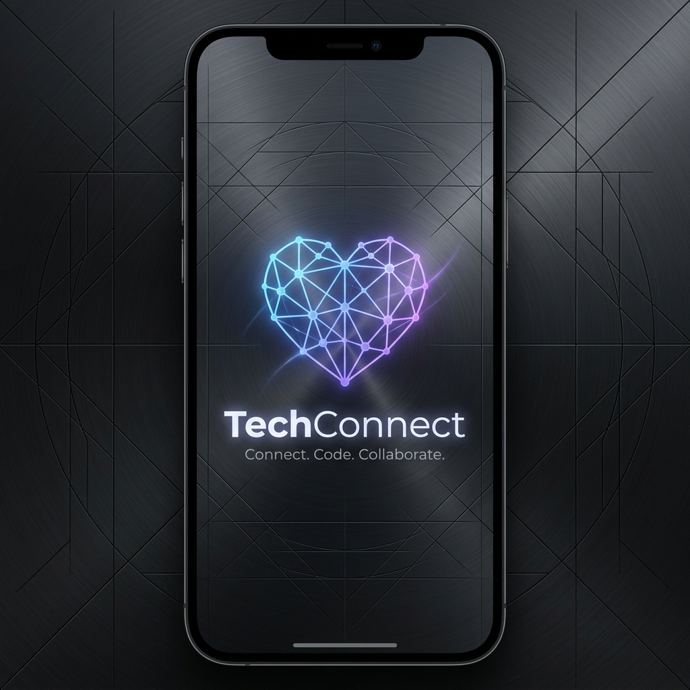
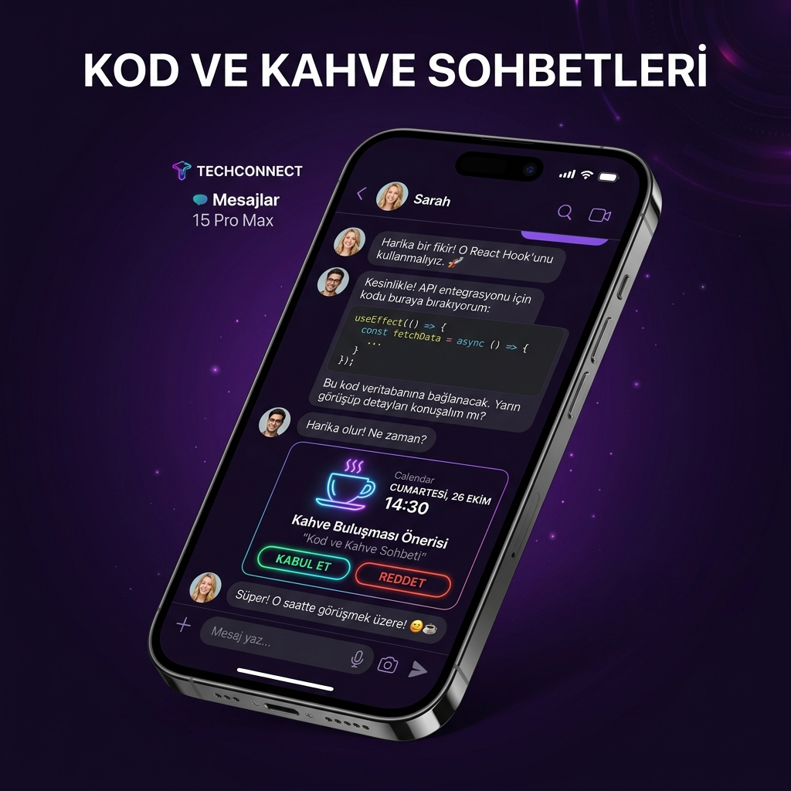

<div align="center">
  

  <h1>TechConnect — DevMatch</h1>
  <p><strong>Yazılımcılar için networking uygulaması</strong></p>

  <p>
    
    
    
    
    
    
  </p>

  
  &nbsp;&nbsp;
  
</div>

---

## 📖 Hakkında

**TechConnect**, yazılımcıların birbirini keşfetmesi, mentor bulması ve iş birliği yapması için tasarlanmış bir iOS networking uygulamasıdır. Tinder benzeri swipe mekanizması, gerçek zamanlı mesajlaşma ve Coffee Chat özelliğini bir araya getirir.

> **Hedef Kitle:** iOS/Android geliştiriciler, backend yazılımcılar, UI/UX tasarımcılar, cloud mimarlar — kısacası IT sektöründeki herkes.

---

## ✨ Özellikler

| Özellik | Açıklama |
|---------|----------|
| 🔍 **Discover** | Sektör, tech stack ve "ne arıyorsun" tercihine göre eşleşme kartları |
| 💡 **Compatibility Score** | Ortak teknoloji, sektör ve hedef bazlı uyumluluk puanı |
| ❤️ **Swipe / Match** | Çift taraflı beğeni → otomatik match oluşturma |
| 💬 **Gerçek Zamanlı Mesajlaşma** | WebSocket tabanlı anlık mesajlaşma |
| ☕ **Coffee Chat** | Match edilen kişiyle buluşma teklifi & kabul/red mekanizması |
| 🔐 **GitHub Doğrulama** | Kayıt sırasında GitHub kullanıcı adı ile IT kimlik doğrulaması |
| 👑 **PRO Abonelik** | RevenueCat entegrasyonu — sınırsız beğeni + gelişmiş filtreler |
| 🎨 **Dark / Light Mode** | Dinamik tema desteği |

---

## 🏗 Proje Yapısı

```
datingApp/
├── TechConnectApp/          # iOS uygulaması (SwiftUI)
│   └── TechConnectApp/
│       ├── Views/
│       │   ├── Splash/      # Açılış ekranı
│       │   ├── Onboarding/  # İlk kullanım akışı
│       │   ├── Login/       # Giriş / Kayıt
│       │   ├── Discover/    # Swipe kartları & match animasyonu
│       │   ├── Chats/       # Match listesi & mesajlaşma
│       │   └── Profile/     # Profil yönetimi
│       ├── Models/          # Swift data modelleri
│       ├── Services/        # APIService, WebSocket, RevenueCat
│       └── Components/      # Paylaşılan UI bileşenleri
│
└── backend/                 # REST API (Spring Boot)
    └── src/
        ├── main/java/com/techconnect/backend/
        │   ├── controller/  # REST endpoint'leri
        │   ├── service/     # İş mantığı katmanı
        │   ├── model/       # JPA entity'leri
        │   ├── repository/  # Spring Data JPA
        │   ├── dto/         # Request / Response DTO'ları
        │   └── config/      # Security, JWT, WebSocket, CORS
        └── test/            # 44 unit test
```

---

## 🛠 Teknoloji Stack'i

### iOS (Client)
- **SwiftUI 5** — Deklaratif UI
- **Combine** — Reaktif veri akışı
- **URLSession** — REST API iletişimi
- **WebSocket** — Gerçek zamanlı chat
- **RevenueCat SDK** — Abonelik yönetimi

### Backend (Server)
- **Java 21** + **Spring Boot 3.2.5**
- **Spring Security** + **JWT (JJWT 0.12.5)** — Stateless auth
- **Spring Data JPA** + **PostgreSQL** — Kalıcı veri
- **Flyway** — Database migration
- **Spring WebSocket (STOMP)** — Gerçek zamanlı mesajlaşma
- **Docker** — Container deployment

### DevOps
- **Render.com** — Backend deployment
- **PostgreSQL** — Production veritabanı

---

## 🚀 Kurulum

### Ön Gereksinimler

- Xcode 15+
- Java 21+
- Maven 3.9+
- PostgreSQL 14+
- Docker (opsiyonel)

### Backend

```bash
# 1. Repo'yu klonla
git clone https://github.com/ahmethakanyldrm/DevMatch.git
cd DevMatch/backend

# 2. Ortam değişkenlerini ayarla
cp ../.env.example .env
# .env dosyasını kendi değerlerinle doldur

# 3. Çalıştır
mvn spring-boot:run
```

**Docker ile:**
```bash
docker build -t techconnect-backend .
docker run -p 8080:8080 \
  -e DB_URL=jdbc:postgresql://host.docker.internal:5432/techconnect \
  -e DB_USERNAME=postgres \
  -e DB_PASSWORD=postgres \
  -e JWT_SECRET=your_secret \
  techconnect-backend
```

### iOS Uygulaması

1. `TechConnectApp/TechConnectApp.xcodeproj` dosyasını Xcode ile aç
2. `APIService.swift` dosyasındaki `baseURL`'i kendi backend adresinle güncelle
3. Simülatör veya gerçek cihazda çalıştır (`Cmd+R`)

---

## 🌐 API Referansı

**Base URL (Production):** `https://devmatch-u36s.onrender.com`

### Auth (Public)
| Method | Endpoint | Açıklama |
|--------|----------|----------|
| `POST` | `/api/v1/auth/register` | Yeni hesap oluştur |
| `POST` | `/api/v1/auth/login` | Giriş yap, JWT al |

### Profil (🔐 JWT gerekli)
| Method | Endpoint | Açıklama |
|--------|----------|----------|
| `GET` | `/api/v1/profiles/me` | Kendi profilini getir |
| `PUT` | `/api/v1/profiles/me` | Profilini güncelle |
| `DELETE` | `/api/v1/profiles/me` | Hesabı sil |
| `POST` | `/api/v1/profiles/me/photo` | Fotoğraf yükle |
| `GET` | `/api/v1/profiles/discover` | Keşfet kartlarını getir |

### Swipe & Match (🔐 JWT gerekli)
| Method | Endpoint | Açıklama |
|--------|----------|----------|
| `POST` | `/api/v1/swipes` | Beğen / Geç |
| `GET` | `/api/v1/matches` | Match listesini getir |
| `GET` | `/api/v1/matches/{matchId}/messages` | Mesajları getir |
| `POST` | `/api/v1/matches/{matchId}/messages` | Mesaj gönder |

### Coffee Chat (🔐 JWT gerekli)
| Method | Endpoint | Açıklama |
|--------|----------|----------|
| `POST` | `/api/v1/coffee-chats` | Buluşma teklif et |
| `PUT` | `/api/v1/coffee-chats/{id}/status` | Kabul / Reddet |
| `GET` | `/api/v1/coffee-chats/match/{matchId}` | Match'e ait teklifler |

**Authorization header formatı:**
```
Authorization: Bearer <jwt_token>
```

**Register örneği:**
```json
POST /api/v1/auth/register
{
  "email": "ahmet@example.com",
  "password": "Test1234!",
  "displayName": "Ahmet Hakan",
  "githubUsername": "ahmethakanyldrm",
  "role": "iOS Developer",
  "experienceYears": 4,
  "sector": "STARTUP",
  "lookingFor": "COLLABORATION",
  "city": "İstanbul",
  "isRemote": true,
  "techStack": ["Swift", "SwiftUI", "Java"],
  "gender": "MALE",
  "preferredGender": "EVERYONE"
}
```

**Enum değerleri:**
- `sector`: `STARTUP` `CORPORATE` `FREELANCE`
- `lookingFor`: `MENTOR` `MENTEE` `COLLABORATION` `COFFEE_CHAT`
- `gender`: `MALE` `FEMALE`
- `preferredGender`: `MALE` `FEMALE` `EVERYONE`

---

## ⚙️ Ortam Değişkenleri

`.env.example` dosyasını kopyalayarak `.env` oluşturun:

```env
# Veritabanı
DB_URL=jdbc:postgresql://localhost:5432/techconnect
DB_USERNAME=postgres
DB_PASSWORD=postgres

# JWT
JWT_SECRET=your_super_secret_jwt_key_at_least_256_bits_long

# RevenueCat
REVENUECAT_API_KEY=your_revenuecat_api_key
```

---

## 🧪 Testler

```bash
cd backend
mvn test
```

```
Tests run: 44, Failures: 0, Errors: 0, Skipped: 0
BUILD SUCCESS  (≈ 2.2s)
```

| Test Sınıfı | Test Sayısı | Kapsam |
|-------------|-------------|--------|
| `JwtUtilsTest` | 6 | Token üretim, parse, doğrulama |
| `AuthServiceTest` | 6 | Login, register, hata senaryoları |
| `ProfileServiceTest` | 11 | CRUD, discover filtresi, uyumluluk skoru |
| `SwipeServiceTest` | 8 | Match, upsert, FREE limit, PRO |
| `ChatServiceTest` | 6 | Match listesi, mesaj okuma/gönderme |
| `CoffeeChatServiceTest` | 7 | Öneri, statü güncelleme, listeleme |

---

## 🔒 Güvenlik

- Tüm korunan endpoint'ler **JWT Bearer token** doğrulaması gerektirir
- Token geçerlilik süresi: **30 gün**
- Kayıt sırasında **GitHub API** ile IT kimlik doğrulaması
- Şifreler **BCrypt** ile hashlenir
- FREE kullanıcılar için **24 saatte 10 beğeni** limiti

---

## 📄 Lisans

[MIT License](LICENSE) — © 2026 Ahmet Hakan Yıldırım
