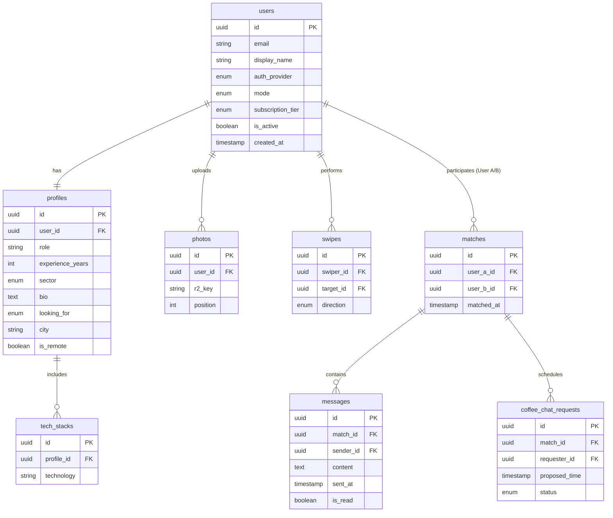

<p align="center">
  
</p>

<h1 align="center">TechConnect</h1>

<p align="center">
  <strong>Geliştiriciler, Tasarımcılar ve Ürün Yöneticileri için Yeni Nesil Profesyonel Eşleşme ve Network Platformu</strong>
</p>

<p align="center">
  
  
  
  
  
  
</p>

---

## 🌟 Proje Hakkında

**TechConnect**, teknoloji dünyasındaki profesyonellerin (yazılımcılar, tasarımcılar, ürün yöneticileri vb.) ortak teknoloji ilgi alanları, kariyer hedefleri, deneyim seviyeleri ve çalışma modellerine göre birbirleriyle bağlantı kurmasını sağlayan dinamik bir profesyonel eşleşme platformudur.

Sıradan profesyonel ağların aksine, **Swipe (Kaydırma)** mekaniğini modern bir eşleşme algoritmasıyla birleştirerek kullanıcıların en doğru kişilerle kahve sohbetleri (Coffee Chat), mentörlük ilişkileri veya iş ortaklıkları kurmasını kolaylaştırır. Ayrıca MVP sonrasında aktif edilebilecek **Dating (Flört)** modu ile aynı sektörü ve ilgi alanlarını paylaşan teknoloji profesyonellerinin kişisel düzeyde de eşleşmesine olanak tanır.

---

## 🚀 Öne Çıkan Özellikler

*   **Çift Yönlü Mod (Network & Dating):** Kullanıcılar isterlerse yalnızca profesyonel network odaklı, isterlerse de hem network hem flört odaklı profiller oluşturabilirler. (MVP için öncelik Network modundadır).
*   **Akıllı Eşleşme Algoritması:** Ortak kullanılan teknolojiler, sektörel uyum (startup, kurumsal, freelance), deneyim yılı farkları ve aranılan ilişki türü (mentör/mentee, iş birliği vb.) baz alınarak geliştirilmiş özel bir puanlama sistemi.
*   **Anlık Mesajlaşma & STOMP:** Eşleşen kullanıcıların gerçek zamanlı ve kesintisiz sohbet edebilmesini sağlayan WebSocket tabanlı mesajlaşma yapısı.
*   **Kahve Sohbeti (Coffee Chat) Talepleri:** Doğrudan sohbet arayüzü üzerinden planlanabilen ve onaylanabilen yüz yüze veya online kahve görüşmesi istekleri.
*   **RevenueCat Entegrasyonu:** Pro üyelik (Pro Tier) özellikleri, sınırsız kaydırma ve özel filtreler için abonelik altyapısı.
*   **Gelişmiş Filtreleme:** Kurumsal e-posta doğrulama filtresi sayesinde iş arkadaşları veya belirli şirket çalışanlarını gizleme seçeneği.

---

## 🛠️ Tech Stack

### Mobil (Frontend)
*   **Dil & Framework:** Swift + SwiftUI (iOS 16+)
*   **Tasarım:** Dark Mode öncelikli, modern glassmorphism efektleri ve gradyan geçişli UI tasarımı.
*   **Bildirimler:** Firebase Cloud Messaging (FCM) ile anlık bildirimler.

### Sunucu (Backend)
*   **Dil & Framework:** Java 21 + Spring Boot 3.x
*   **Güvenlik:** JWT tabanlı kimlik doğrulama, Apple Sign In & GitHub OAuth entegrasyonları.
*   **Mesajlaşma:** Spring WebSocket + STOMP protokolü.
*   **Dosya Depolama:** Cloudflare R2 (S3 uyumlu nesne depolama).

### Veri Tabanı & Altyapı
*   **Ana Veri Tabanı:** PostgreSQL 16
*   **Veri Tabanı Göçü (Migration):** Flyway
*   **Abonelik Yönetimi:** RevenueCat API & Webhooks

---

## 📊 Veri Tabanı Şeması ve Modeli

Uygulamanın ilişkisel veri tabanı tasarımı aşağıdaki temel tablolardan oluşmaktadır:



---

## 🧮 Akıllı Eşleşme Algoritması

Sistem, Keşfet (Discover) ekranında kullanıcıların karşısına çıkacak kartları şu formüle göre önceliklendirir:

$$\text{Skor} = (T \times 3) + S + C + E - P$$

*   **Ortak Teknolojiler ($T$):** Profilde eşleşen her ortak teknoloji için $+3$ puan.
*   **Aynı Sektör ($S$):** İki kullanıcı da aynı sektördeyse (örneğin ikisi de Startup) $+2$ puan.
*   **Uyum ($C$):** İlişki beklentisi uyumu (Mentör $\leftrightarrow$ Mentee eşleşmesi ya da ortak Proje İş Birliği hedefi) durumunda $+4$ puan.
*   **Deneyim Farkı ($E$):** Deneyim yılları arasındaki fark 3 yıl veya daha az ise $+1$ puan.
*   **Geçmiş Etkileşimler ($P$):** Kullanıcı daha önce bu kartı sağa veya sola kaydırdıysa $-1000$ puan (keşfet listesinden elenir).

---

## 💻 Kurulum ve Çalıştırma

### 1. Gereksinimler
*   Java 21 (JDK 21)
*   Maven 3.8+
*   Xcode 15+ (iOS simulator veya cihaz için)
*   PostgreSQL 16

### 2. Backend Projesini Başlatma
1.  Veri tabanını oluşturun:
    ```sql
    CREATE DATABASE techconnect;
    ```
2.  `backend/src/main/resources/application.yml` dosyasındaki veri tabanı bilgilerini kendi ortamınıza göre güncelleyin.
3.  Projeyi derleyin ve çalıştırın:
    ```bash
    cd backend
    mvn clean install
    mvn spring-boot:run
    ```

### 3. iOS Uygulamasını Başlatma
1.  Xcode'u açın.
2.  `TechConnectApp/TechConnectApp.xcodeproj` dosyasını Xcode ile yükleyin.
3.  Simülatör olarak en az **iOS 16** seçtiğinizden emin olun.
4.  `Cmd + R` tuş kombinasyonuyla uygulamayı derleyip çalıştırın.

---

## 📅 Geliştirme Yol Haritası

- [x] **Faz 1: MVP İskelet Kurulumu (Tamamlandı)**
  - Proje klasör yapısının ve Git ayarlarının tamamlanması.
  - Spring Boot ve SwiftUI şablon projelerinin oluşturulması.
- [ ] **Faz 2: Temel Network Özellikleri (Geliştiriliyor)**
  - Veri tabanı modelleri ve Flyway entegrasyonu.
  - JWT ve Mock Sosyal Giriş yapıları.
  - Eşleşme algoritmasının yazılması ve kart kaydırma akışı.
  - SwiftUI Arayüz tasarımları (Kart destesi, Profil detay, Bağlantılarım listesi).
- [ ] **Faz 3: İletişim, Ödemeler ve Dating Modu**
  - WebSocket (STOMP) tabanlı anlık mesajlaşma.
  - RevenueCat entegrasyonu (Pro Üyelik).
  - Dating (Flört) modunun aktif edilmesi.
  - Kurumsal e-posta filtresi entegrasyonu.

---

## 📄 Lisans

Bu proje **MIT Lisansı** altında lisanslanmıştır. Detaylar için [LICENSE](LICENSE) dosyasına göz atabilirsiniz.
